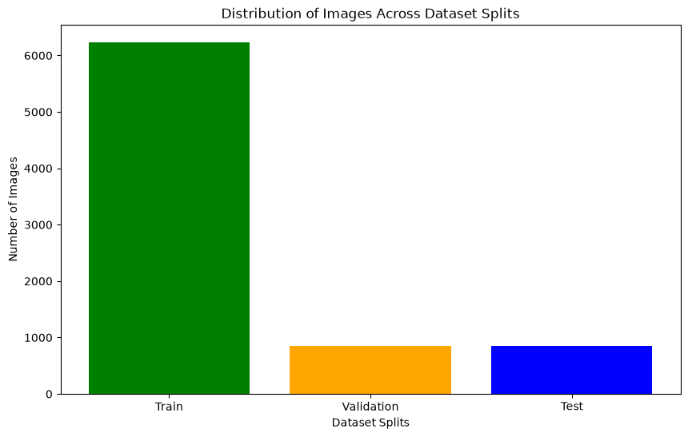
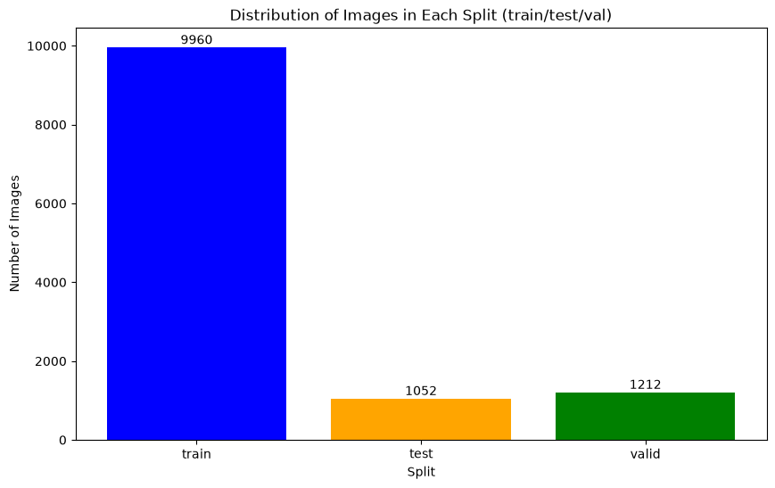
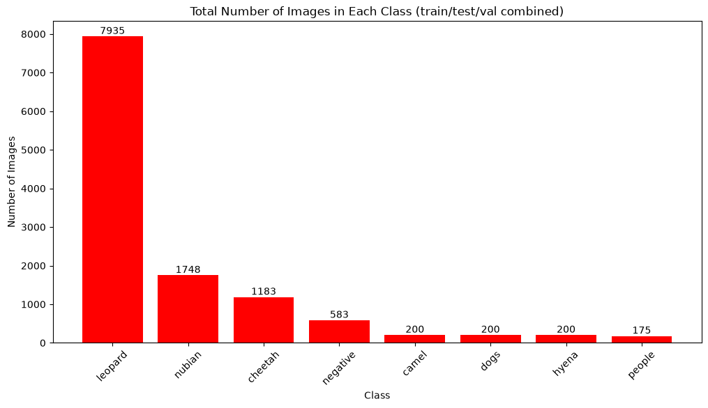

# Data & Data Collection

This branch documents the datasets used to train the Arabian Leopard detection models (v1 and v2), including their source, format conversion, and distribution across splits.

## Table of Contents

- [v1 Dataset (Leopard-only)](#v1-dataset-leopard-only)
  - [Overview](#overview)
  - [Format Conversion](#format-conversion)
  - [Split Distribution](#split-distribution)
- [v2 Dataset](#v2-dataset)
  - [Overview](#overview-1)
  - [Merge \& Balancing](#merge--balancing)
  - [Split Distribution](#split-distribution-1)
  - [Class Distribution](#class-distribution)
- [Data Source](#data-source)

---

## v1 Dataset (Leopard-only)

### Overview

The first model (v1) was trained on a single class: `leopard`. No other classes were included.

### Format Conversion

The original data came in **COCO format**. It was converted to **YOLO format** using `ultralytics.data.converter.convert_coco`. The full conversion process is documented in `notebooks/v1_train.ipynb`.

### Split Distribution

Total images across all splits: **7,935**

| Split      | Images |
|------------|--------|
| Train      | 6,232  |
| Validation | 849    |
| Test       | 854    |



> Note: v1 is deprecated and not actively used. This section is kept for reference only.

---

## v2 Dataset

### Overview

v2 expands from single-class (leopard) to **8 classes**:

```
leopard, cheetah, hyena, nubian_ibex, camel, cat, dog, person
```

Leopard images are reused from the v1 dataset (LILA) plus an additional [Roboflow leopard set](https://universe.roboflow.com/namratha-jujya/leopard-nbxvh). All other classes were sourced fresh from Roboflow Universe (see [Data Source](#data-source)). A **Caracal** dataset was also collected but dropped due to poor source annotations, and an **Arabian Gazelle** dataset was collected but not included in the final class list.

A set of **negative samples** was added to reduce false positives. These were scraped from the internet (background/empty scenes containing none of the 8 target classes) and paired with empty `.txt` label files.

### Merge & Balancing

All per-class Roboflow exports (YOLO format) were merged into a single `v2_yolo_dataset` with a unified `data.yaml`. To keep the dataset from being dominated by any one class:

- Most classes were **capped at 200 images**.
- `cheetah` and `Negative Samples` were left **uncapped**.
- `leopard` keeps its full v1 count (already large from LILA).

Full merge logic is in `notebooks/v2_Train.ipynb`.

### Split Distribution

Total images across all splits: **12,224**

| Split | Images |
|-------|--------|
| Train | 9,960  |
| Test  | 1,052  |
| Valid | 1,212  |

Chart: `results/training/v2/data_distribution.png`

### Class Distribution

| Class    | Images |
|----------|--------|
| leopard  | 7,935  |
| nubian   | 1,748  |
| cheetah  | 1,183  |
| negative | 583    |
| camel    | 200    |
| dogs     | 200    |
| hyena    | 200    |
| people   | 175    |  

  



> Note: class imbalance (leopard-heavy) is a known issue — see backlog in the main project README for planned rebalancing/retraining.

---

## Data Source

- **LILA BC (Labeled Information Library of Alexandria: Biology and Conservation):** https://lila.science/datasets (leopard, v1 + v2)
- **Roboflow Universe** (v2 additional classes, all CC BY 4.0):
  - Leopard: https://universe.roboflow.com/namratha-jujya/leopard-nbxvh
  - Cheetah: https://universe.roboflow.com/animal-detection-uausv/cheetah-7mzvi
  - Hyena: https://universe.roboflow.com/sakshi-0ll7y/hyena
  - Nubian Ibex: https://universe.roboflow.com/shlomi-peretz-1evif/nubian-ibex-finder
  - Camel: https://universe.roboflow.com/project-5last/camel-hyh5i
  - Dogs & Cats: https://universe.roboflow.com/birds-gbqbp/dogs-and-cats-pcdpa
  - People: https://universe.roboflow.com/yara-hashesh-9u8ie/people-ojb8y
  - Arabian Gazelle *(collected, not used in final classes)*: https://universe.roboflow.com/abdullahs-workspace-ssppk/arabian-gazells-0syuh
